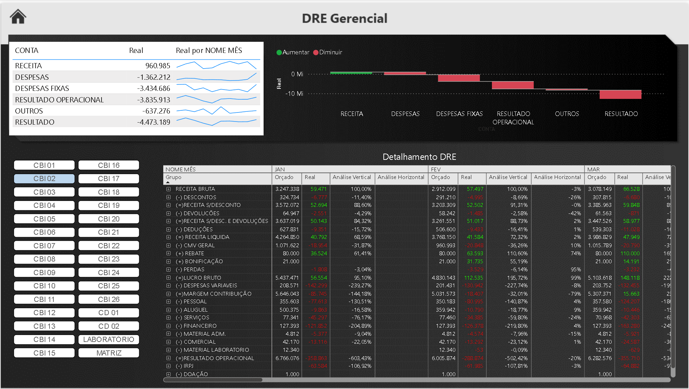

# 📊 Análise de DRE no Power BI | Estudo de Caso

## 📊 Dashboard no Power BI

Este projeto consiste em um **estudo de caso de Análise de Dados e Business Intelligence**, utilizando uma **Demonstração do Resultado do Exercício (DRE)** como base para construção de um **dashboard no Power BI**, com foco em análise financeira e apoio à tomada de decisão.

O projeto foi desenvolvido como parte do meu **portfólio para Analista de Dados**, demonstrando a capacidade de transformar dados financeiros em informações claras, visuais e estratégicas.

---

## 🎯 Objetivo do Projeto

- Analisar o desempenho financeiro da empresa a partir da DRE
- Aplicar **análise vertical e horizontal**
- Criar **KPIs financeiros** relevantes
- Desenvolver um **dashboard interativo no Power BI**
- Demonstrar raciocínio analítico e visão de negócio

---

## 📁 Fonte dos Dados

- Dados **fictícios / simulados**, criados exclusivamente para fins educacionais e de portfólio
- Estrutura baseada em uma DRE real, respeitando boas práticas contábeis

---

## 📊 Análises Realizadas

### 🔹 Análise Vertical
- Cada linha da DRE foi analisada como percentual da **Receita Líquida**
- Permite entender a **estrutura de custos, despesas e margens**
- Identificação do peso de cada componente no resultado final

### 🔹 Análise Horizontal
- Comparação dos resultados entre períodos
- Avaliação da **evolução da receita, custos, despesas e lucro**
- Identificação de tendências e variações relevantes

---

## 📈 Principais Indicadores (KPIs)

- Receita Líquida
- Custo Total
- Margem Bruta
- Despesas Operacionais
- Resultado Operacional
- Lucro Líquido
- Margem Líquida (%)

---

## 🛠️ Ferramentas Utilizadas

- **Power BI**
- **Power Query** (tratamento e transformação dos dados)
- **DAX** (medidas e cálculos)
- **Excel** (estruturação inicial dos dados)

---

---

## ▶️ Vídeo Explicativo no YouTube

No vídeo abaixo, explico:
- Conceito de DRE
- Análise vertical e horizontal
- Construção do dashboard no Power BI
- Interpretação dos principais resultados

🎥 **Assista aqui:**  
👉 https://youtu.be/YEhF-Mr_tug

---

## 🚀 Como Utilizar o Projeto

1. Faça o download do arquivo `.pbix`
2. Abra no **Power BI Desktop**
3. Atualize as consultas no Power Query (se necessário)
4. Explore os filtros e visuais do dashboard

---

## 📌 Observações

- Este projeto tem finalidade **educacional e demonstrativa**
- Nenhum dado sensível ou real de empresa foi utilizado
- O foco é demonstrar **capacidade analítica, visualização e interpretação de dados**

---

## 👤 Autor

**José Valdir Calixto**  
Analista de Dados

🔗 Portfólio: https://portfolio-jvc.vercel.app/  
🔗 LinkedIn: https://www.linkedin.com/in/josevaldircalixto  

---

📊 *Projeto desenvolvido para demonstrar habilidades em Análise de Dados, Business Intelligence e interpretação financeira.*

